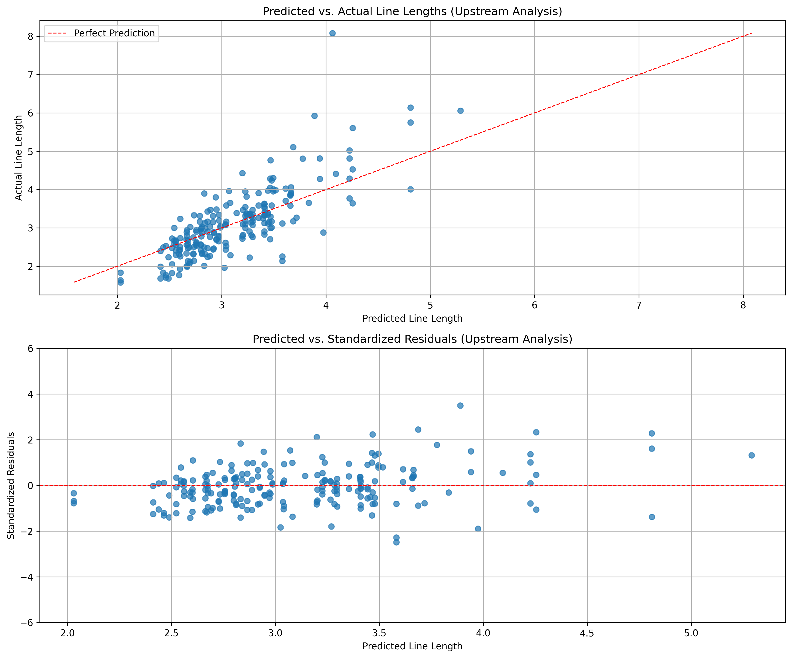
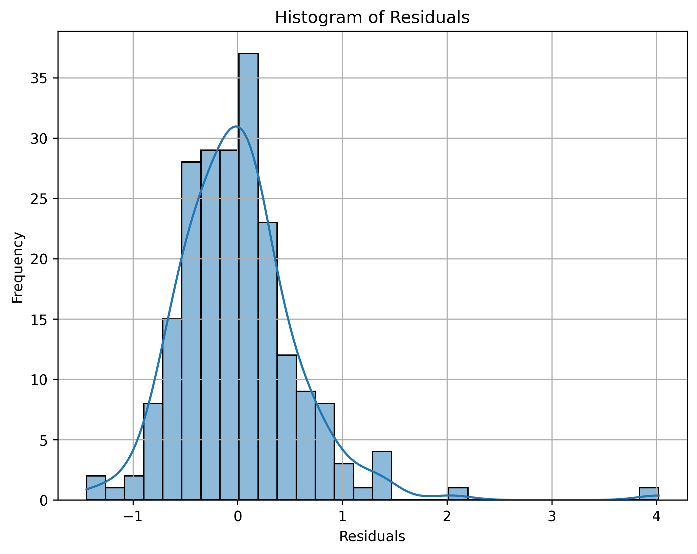

---
author:
- Liam Hawes, SUNY ESF

title: Effects of Beaver Dam Analogues at Red Canyon Creek Wyoming
---

# Introduction

The study of river and stream restoration has seen a surge in interest over the past few decades, with a particular focus on the role of natural and artificial structures in shaping fluvial landscapes. Among these structures, Beaver Dam Analogs (BDAs) have emerged as a significant area of study. BDAs are human-made structures designed to mimic the ecological and geomorphological effects of natural beaver dams, with the aim of restoring degraded stream ecosystems and promoting landscape resilience (Goldfarb, 2018).

The construction of BDAs typically involves the strategic placement of posts into the stream-bed with a hydraulic ram, which are then interwoven with smaller branches, typically willow, to mimic the dam-building behavior of beavers. The structures are sometimes filled with local sediment and rocks to provide stability and to encourage the deposition of additional sediment over time. This process creates a barrier that slows water flow, ideally allowing for the formation of ponded areas upstream of the dam, much like a natural beaver dam (Pollock et. al., 2023).

BDAs also hope to strategically raise and widen incised stream-beds, allowing for better floodplain connectivity and reducing the risk of further channel separation. Ideally, they will also facilitate the expansion of riparian vegetation, enhancing habitat diversity and promoting the establishment of healthy stream ecosystems. Additionally, the structures could promote increased stream sinuosity and aid in dissipating energy and reducing stream velocities, with the goal of mitigating further incised erosion and enhancing sediment deposition. As a result, BDAs will ideally foster the development of an inset floodplain, leading to an overall resilience and ecological integrity of the stream system (Pollock et. al., 2014). These multifaceted benefits make BDAs a promising tool in river and stream restoration efforts, with the potential to restore degraded ecosystems and create more sustainable fluvial landscapes.

A variety of techniques can be used to determine the impact of Beaver Dam Analogs (BDAs) on the environment. Remote sensing and GIS analysis has been historically used to provide a broad scale view of Rivers and waterways. This technique can be adapted to determine the impact of BDAs with imagery from UAVs. UAV imagery is ideal due to the lower cost and high resolution data that can be achieved. For finer resolution, a terrestrial laser scanner system can be used. However, the equipment is expensive and data analyses can be cumbersome compared to UAV. Other Remote sensing techniques like acoustic Doppler current profiler and multibeam echo sounder can be used to analyze river morphology though the end user cost is greater than UAV with more difficult data analysis (Tomsett & Leyland, 2019). Non remote sensing techniques such as erosion pins and repeated cross-profiling can be used. Erosion pins can give highly accurate values at specific points that can be used to ensure other measurement techniques are correct. They are also affordable but do not give an idea of the entire river like UAV does. Repeated Cross-profiling is highly accurate and can detect changes in point bars and banks along with changes in the channel shape (Lawler, 1993). Still, the time intensive nature limits the number of points that can be taken which makes it an ideal complement to a large but less fine datasets like UAV.

# Objectives

We Hypotesise that (1) the typical lifespan of a BDA in our river system is less than 1 year, (2) of the BDAs that do fail, the majority will have side cut failure, with the rest failing to breach or undercut. (3) BDAs that have failed from sidecut will lead to a narrowing channel due to deposition behind the intact portion of the BDA. For BDAs that retain water, no effect on the width is expected but deposition will occur behind. (4) Finally, we expect the BDAs to result in more rapid channel evolution than the channel witout BDAs. 

<\meh line> In this report we try to determine if the proposed benefits of reducing erosion and increased sediment deposition from BDAs actually occurs. 

We do this by asking how BDAs impact river width? To ascertain the impact, this paper looks at the changes in river width 5 meter above and below the BDAs. We then utilize a mixed effects model to predict the changing river width and determine how much of it is due to BDAs being installed. This method struggles due to the changing flows of the river. It also does not consider the differences in erosion at different locations. For example, incised erosion is not treated differently compared to normal bank side erosion. 

# Methods

## Site

The analysis site is located in Wyoming, south of the Wind River reservation (add cords/ fig showing site and general location). The river is flow controlled for irrigation purposes (Find source) and typically does not experience yearly changes of flows by an order of magnitude (source, little papapogie river flows?).

BDAs were installed back in the summer of 2018. However, only 5 were put in and 3 survived the year. The majority of the BDAs were installed around august 2022 and brought the total number to 45. Large sections of the creek are difficult to access without wading through the water. Therefore, BDAs were typically placed in locations where assesibility was better. Some BDAs ended up close to bends and other BDAs (within 15 meters) while other streches between BDAs were up to (UPDATE VALUE) 75 meters. 

## BDA Survey

The BDAs were surveyed around the begining august for the 2022 to 2024 year. The condition of the BDAs was recorded. 

#### TODO 
    Elaborate on what data was recoreded and weather it was a subseb of the BDAs or for all the BDAs.

## Imaging

Unoccupied aerial vehicle (UAV) surveys were conducted annually from 2017 to 2024 excluding 2020. Flights occurred between mid July and mid August. Images were taken using a Sony A5100 onboard a DJI Phantom. For 2019, images were captured with a Sony R10 mounted on a DJI M600. The data were then compiled into orthoimages using Pix4D and imported into QGIS 3.30.2 for analysis. Separate polygon masks were created the river for each year by hand. Due to georeferencing issues, the 2018, 2019, and 2021 polygons were translated and rotated to align with the projection from 2017 and 2022. In some cases, the 2021 river mask could not be fully used due to distortions on the north and south section of the orthoimage.

## River Width Line Creation Around BDAs

Center-lines for the river each year were generated by using the river polygons. A plugin was added called HCMGIS where a tool called *Skeleton / Medical Axis* was used to generate a skeletal model of the polygon. From there, the center-line of the skeletal model was traced by hand to ensure correct ordering of the poly-lines. *Points along Geometry* was then used to create evenly spaced points every 0.1 of a meter on the center-line.

River Dividers 5 meters upstream and downstream of the BDAs and reference stretches were generated as follows. The locations of the BDAs were added to a poly-line shape-file along with reference stretches. The reference stretches were placed across the river in locations that were at least 20 meters away from any BDA in locations that appeared to be minimally impacted from any BDAs. *Line Intersections* was used to extract vertices from the intersection between the BDA poly-lines and the river center-line. A 5 meter buffer was generated around the extracted vertices which were converted from a polygon to a poly-line. *Line Intersection* was used again on the center-line and the line circles to generate points approximately 5 meters upstream and downstream of the BDAs. To apply proper geometry data to the points, the attributes of the points along the centerline  were joined together by the nearest neighbor method. River dividers were then created by using *Geometry by Expression* with the command *extend( make_line( \$geometry, project ( \$geometry, 4, radians(\"angle\"-90))),4,0)* where the lines generated are perpendicular to the center-line. The river divider lines were then cleaned up to ensure each line split the river once and that no lines crossed. The river dividers were noted whether they were upstream or downstream of the BDA.

The river divider lines were then trimmed to the river width from the river mask. This was done for 2017, 2022, 2023, and 2024. The other years river masks did not align well due to georeferencing issues. The perpendicular river width lines for the years were joined together by BDA number. Indicators were added for whether the location was upstream or downstream of the BDA and if a BDA was present for at least one year prior. The dataset struggles from autocorrelation likely due to the close proximity of the BDAs.

The final output was a csv containing the following information: Year, BDA Number, Reference Number, Downstream, BDA Presence, Transect Line Length, and Comments. Year is the year of the flight. BDA number is the ID of the BDA used. Reference number is the ID of the reference lines. Downstream is an indicator where a 1 means the line length is downstream 5 meters of the BDA number. BDA presence is whether there was a BDA present at the location for at least 1 year. Transect Line Length is the river width at that location for that year. Comments are any notes about a specific transect.

## Analysis of River Widths

The impact of BDAs on river width was tested by using a linear mixed effects model to predict the change in river width based on the presence of a BDA at that site and year. Let $W_{i}$ be a random variable that is the width recorded, at location $i$. A mixed effects model can be used to model the change in river widths:

$$W_{i} = \theta_{i} + \beta_{1i} \cdot BDA_{i,j}$$

Where $\theta_{i}$ is an intersect, $BDA_{i,j}$ is whether there is a BDA within 5 meters for 1 year or longer for location $i$ and year $j$. From this model, we can see if the river significantly changes in width due to the BDAs.

The model was coded into *python 3.12.0* utilizing the *statsmodels.formula.api*. The model was run on the data filtered for only the upstream line lengths and the downstream line lengths. To determine the impact from the BDA on the river width, the value of $\beta_{1}$ and its significance will be used.

Plots of the models residuals were constructed. These include predicted vs actual and predicted vs standardized residuals of the line lengths. A histogram of the residuals was also plotted. A spatial plot of the residuals was constructed and a spatial variogram. The Moran's I value was found using a bandwidth of 40 meters on a gaussian distribution.

Mean and standard deviation were determined for the upstream and downstream sections separately. A boxplot of Line length based on BDA presence for the upstream section was created. Comparison of the actual vs predicted line lengths along with line length by year for upstream and downstream was plotted. These outputs will be used to determine the physical plausibility of the model outputs.

# Results

## Model Output
For the upstream analysis, the model outputted an intercept of 3.44 (std. error 0.13), BDA presence as a -0.37 (std. error 0.16, P-value 0.018), and the site variance as 0.49 (std. error 0.23). The downstream analysis resulted in an intercept of 3.42 (std. error 0.14), BDA presence as a -0.096 (std. error 0.14, P-value 0.5,) and the site variance as 0.66 (std. error 0.34). As seen in figure 5, the upstream model generally underestimates river widths that are larger while overestimating the shorter river sections compared for the 2023 line lengths.

## Autocorrelation and Residuals
The moran's I value of the dataset was determined to be 0.31 with a P value of 0.02. This positive spatial autocorrelation can be seen in figure 3, where the residuals on the lines do not appear to be randomly distributed. The residuals for model seen in figure 1, appear to be randomly distributed but a slight cone can be seen when the predicted line length gets longer. Figure 2 shows that the residuals are approximately normally distributed.

## Simple Statistical outputs
The mean and standard deviation of the river width when BDAs were present is 3.27 and 0.98 respectively. When no BDAs were present the mean was 3.43 with a standard deviation of 1.12. Figure 4 shows a boxplot of the upstream line lengths by BDA presence. Generally, when BDAs are present the river width decreases. Though the first quartile did not decrease. Looking at the upstream and downstream line length by year, (Figures 6 and 7) There appears to be little correlation for the downstream from year to year. The upstream seems slightly more related but still has a high amount of variance.

### Figure 1: Predicted vs Actual and Residuals

*Top: plot of the predicted line length against the actual line length of the upstream 5 meter lines. The red line represents perfect predictions from the model. Bottom: Standardized residuals plot for the upstream 5 meter predicted line length.*

---

### Figure 2: Histogram of Residuals

*Histogram of the residuals for the upstream 5 meter model analysis. The blue line represents a kernel density estimate to help visualize the distribution.*

---
### Figure 3: Spatial Plot of Residuals

*Spatial plot of model residuals centered around zero. Each line is the upstream BDA river width transect. River flows from bottom (South) to top (North.)*

---

### Figure 4: Boxplot of Line Length by BDA Presence

*Box plots of upstream 5 meter line length against BDA presence.*

---

### Figure 5: Actual vs Predicted Line Lengths (2023)

*2023 upstream 5 meter line length for each BDA and its predicted length. The data are sorted from greatest to least line length.*

---

### Figure 6: Upstream Line Length for Multiple Years

*Upstream 5 m line length for 2017, 2022, and 2023 sorted from high to low line length for 2023.*

---

### Figure 7: Downstream Line Length for Multiple Years

*Downstream 5 m line length for 2017, 2022, and 2023 sorted from high to low line length for 2023.*

# Discussion

## Impact of the BDAs

The impact of the BDAs appears to be mixed. While there is a statistically significant change in upstream width due to the BDAs (95% CI), the change is not that large in morphological terms. This decrease in width is likely due to deposition of material above the BDA biased to one side of the river. The lack of change in downstream width suggests that the river is getting deeper. This change in depth could occur downstream of the BDA or upstream on the side opposite of the deposition. The variability in year to year widths at the same location (figures 6 and 7) suggest that the BDAs may need more time to stabilize stream width in a consistent manner.

## Possible Reasons For less change compared to literature
There are multiple reasons for the lower change from the BDAs. Firstly,
the majority of the BDAs were installed for only one or two years. Possibly, there could have been too little sediment to lower the permeability of the BDAs, leading to less sediment trapping. High spring flows that shape channels could have also not occurred, reducing the ability for the river to change. Many previous study sites installed BDAs and had beavers collaborating and maintaining the structures. At this time, there were no beavers at this stretch of Red Canyon Creek to help maintain and repair the BDAs.  Determining the impact of BDAs is changeling only one to two years from installation due to the variable flows by year and the need for sediment to lower BDA permeability. Given more time, the impact of BDAs can be better determined.

## Georeferencing issues
Due to the long time frame of this project and multiple groups
collecting data, the georeferencing for all the orthoimages did not
line up. The 2023, 2022, and 2017 images were aligned along with the 2021 and 2018 images mostly being aligned. The orthoimages for
2019 fell between 2017 and 2018 alignment. Most of the referencing
issues could be fixed by either rotating the orthoimages about a
correctly aligned point or translating the images. However the images were still skewed which made it difficult to correct for a river width analysis. As such 2018, 2019, and 2021 were left out of the study to reduce error from imperfect orthoimages.

## Impacts on Robustness of Data
Due to limitations of experimental design, statistical inference is impacted. The locations of the BDAs in the river were not ideally placed to minimize autocorrelation. Rather, they were chosen for ease of installation. The BDAs also typically did not last a year without failing either by washing out, side cutting, over topping, or undercutting. These states of BDA failure were not considered in this report. Changes in river flow, which could affect river width by year were also not included. The site also is not fenced off to cattle or horses. The damage caused by animals could decrease any changes from the BDAs.

## Future Considerations
The study can be improved by considering the differing conditions of BDAs by asking how those conditions impact the river width. Correcting the skew of the orthoimages left out would also expand the number of years of pre BDA data. Incorporating data from 2024 and adjusting for changes in river flow could also improve the models outputs. This study only looked at 5 meters up and down from the BDAs. Varying the distance to the BDA could show larger changes. A range of different distances could be used to try and find the region of greatest impact for the BDAs.   

# Conclusion

In this report we try to determine if the proposed benefits of reducing erosion and increased sediment deposition from BDAs actually occurs. We do this by asking how BDAs impact river width? An increase in width is attributed to erosion while a decrease is due to aggregation of material. A mixed linear effects model was created to determine the change in river width due to BDA installation. We found that there was no change in the downstream river width while there was a slight decrease in width upstream due to the BDAs(-0.37 m, std. error 0.16 m, P-value 0.018). This decrease is attributed to deposition of materials upstream of the BDAs.

# Timeline
1. General Paper improvements
    * continuious 
2. Finish forming dataset
    * add Side Cut/ other failure modes or no failure info
    * By Mar 15
3. Create simple Stats on how the BDAs have failed, and how long they lasted 
    * By Mar 17
4. Update model code to contain be filtered by side cut or by updating the model to include catagories for the BDAs. ie: river width = B0 + B1 * (BDA SC fail) + B2 * (BDA UC Fail) + B3 * (BDA Breach) + B4 (BDA Working)
    * By Mar 21
    * add new results to paper By Mar 25

1. Create new dataset for in depth BDA stats. 
    * This includes info on BDA water depth above and below, phrag amounts (maybe), Head Drop, other usefull info we have. 
    * By Apr 1
2. Create catagorical boxplot of water depth (up and downstream) by Failure type
    * By Apr 3

# References

Goldfarb, B. (2018). Beaver dams without beavers? Artificial logjams are a popular but controversial restoration tool. *Science*. https://doi.org/10.1126/science.aau3887

Pollock, M. M., Lewallen, G. M., Woodruff, K., Jordan, C. E., & Castro, J. M. (2023). The Beaver Restoration Guidebook: Working with Beaver to Restore Streams, Wetlands, and Floodplains (Version 2.02). *United States Fish and Wildlife Service*.

Pollock, M. M., Beechie, T. J., Wheaton, J. M., Jordan, C. E., Bouwes, N., Weber, N., & Volk, C. (2014). Using beaver dams to restore incised stream ecosystems. *BioScience, 64*(4), 279–290. https://doi.org/10.1093/biosci/biu036

Tomsett, C., & Leyland, J. (2019). Remote sensing of river corridors: A review of current trends and future directions. *River Research and Applications, 35*(7), 779–803. https://doi.org/10.1002/rra.3547

Lawler, D. M. (1993). The measurement of river bank erosion and lateral channel change: A review. *Earth Surface Processes and Landforms, 18*(9), 777–821. https://doi.org/10.1002/esp.3290180905

Davis, J., Lautz, L., Kelleher, C., Vidon, P., Russoniello, C., & Pearce, C. (2021). Evaluating the geomorphic channel response to beaver dam analog installation using unoccupied aerial vehicles. *Earth Surface Processes and Landforms, 46*(12), 2349–2364. https://doi.org/10.1002/esp.5182

# How to Use Repository

The repository is based around folders for inputs, outputs, and processing. All code was run in python 3.12.0. The *Raw_Data* folder contains the inputs for the repository. These contain the shape files for each year of the river and the BDA divider file, which contains the locations of the divider lines for the references and BDAs. The *Code* folder contains all code used and is broken into three files: *Process_Data*, *Model_Training*, and *Figures_and_Tables*. The *Process_Data* takes the inputs and creates a analysis ready dataset that is saved as a csv in the *Analysis_Data* folder. The *Model_Training* code then takes this csv as its input and creates the model. Outputs are saved to the *Model_Outputs* and *Code/Model_Data* folders. The *Figures_and_Tables* code utilizes *Code/Model_Data* as an input and outputs to the *Figures_and_Tables* folder.

## Contributing

### Submitting Merge Requests
To contribute to this repository, fork it and create a new branch for your changes. Make sure your code follows the project's guidelines and includes any necessary tests. When your changes are ready, submit a merge request (MR) to the main branch. Include a clear description of your changes and link any related issues. All contributions will be reviewed before being merged. By submitting an MR, you agree that your work will be licensed under the same terms as this project.

### License
This repository is licensed under the **GNU General Public License v3.0** (GPLv3). This license ensures that the code remains free and open-source, and any modifications or derivative works based on this code must also be licensed under the GPLv3. By using, modifying, or distributing this code, you agree to comply with the terms of the GPLv3. For more details, see the [LICENSE](./LICENSE.md) file or visit the [official GPL website](https://www.gnu.org/licenses/gpl-3.0.en.html).